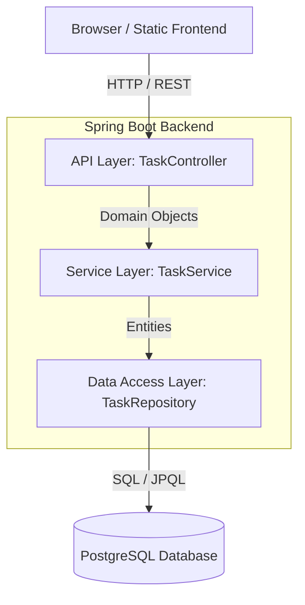
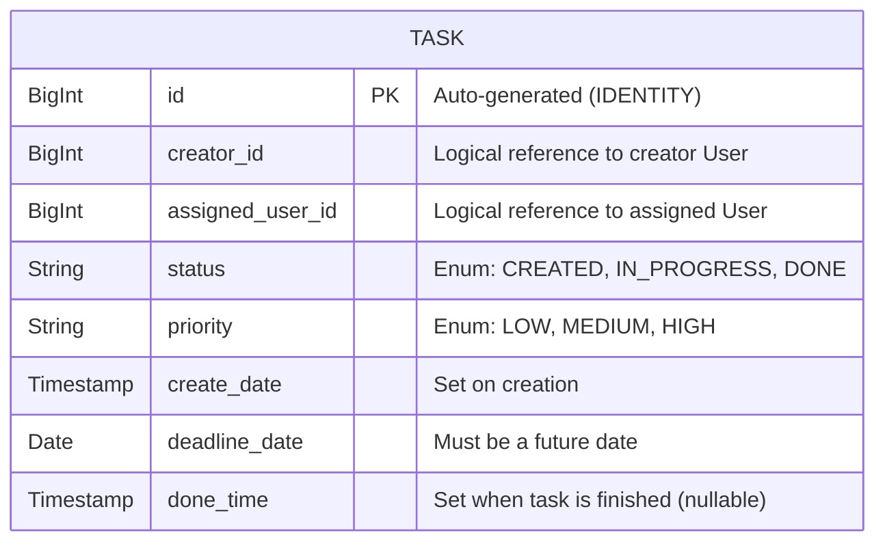
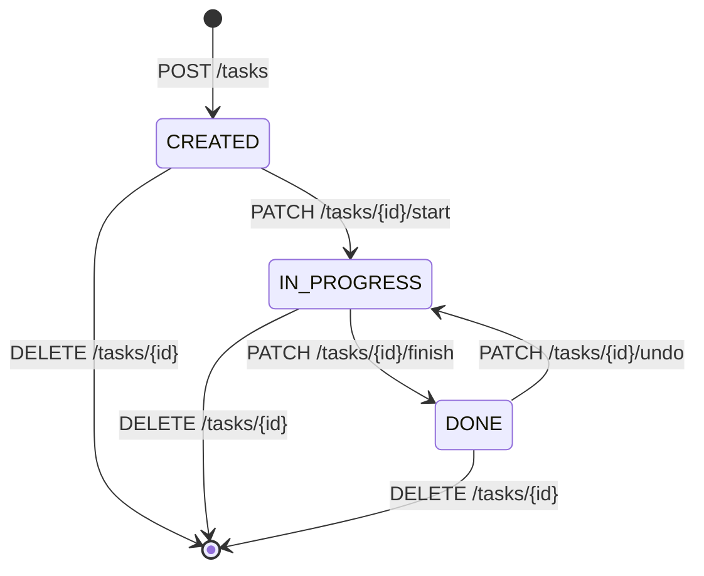
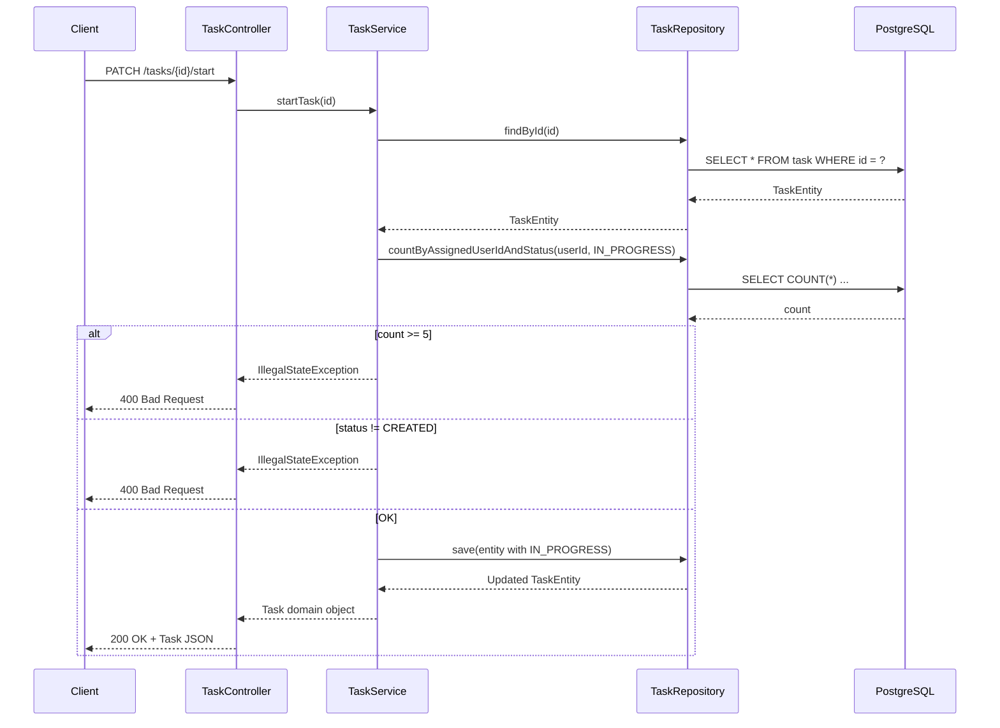

# Task Management System

## 1. Application Description & Purpose

This application is a complete **Task Management System** that allows users to create, track, and manage tasks throughout their full lifecycle. The system handles creating tasks, assigning them to users, and progressing them through defined statuses — from creation, through active work, to completion. Business rules are enforced at every step: for example, a user cannot have more than 5 tasks in progress simultaneously, and completed tasks can be reverted if needed.

The application fulfills all CRUD (Create, Read, Update, Delete) requirements for the `Task` domain, alongside domain-specific lifecycle operations like starting, finishing, and undoing tasks. Filtering with pagination is supported out of the box.

---

## 2. Architectural Design

The application is built using a strict **N-Tier Architecture** (Controller-Service-Repository pattern) to ensure a robust separation of concerns, scalability, and maintainability.

### 2.1 System Architecture Diagram



### 2.2 Layer Breakdown

- **API Layer**: Responsible for handling HTTP requests. Managed by `TaskController`, annotated with `@RestController` and `@RequestMapping("/tasks")`. It validates incoming data and routes requests to the appropriate service method, returning proper `ResponseEntity` with explicit HTTP status codes.
- **Service Layer**: Contains the core business logic — enforced by `TaskService`. It performs rules like the 5-task in-progress limit, status transition validation, and timestamp management.
- **Database Layer**: Abstracts all SQL interaction via Spring Data JPA using `TaskRepository`. Custom JPQL queries handle filtered searches with pagination.

Creating distinct domain objects (`Task`) and database entities (`TaskEntity`) for the Service and Database layers keeps them completely independent. A dedicated `TaskMapper` class acts as the bridge, converting between the two representations.

---

## 3. Database Schema

The system uses a single relational table to store all task data.



---

## 4. System Workflows

### Task Lifecycle



### Start Task — Business Logic Flow



---

## 5. Implementation Details

### Controller Layer and Dependency Injection

The Dependency Injection (DI) process is implemented using constructors and `final` instance fields. Spring Boot's IoC container handles object instantiation automatically.

`TaskController` is annotated with `@RestController` and `@RequestMapping("/tasks")`. The `TaskService` is injected via constructor. All endpoints return `ResponseEntity<>`, which allows explicit control over HTTP status codes (`200 OK`, `201 Created`, etc.) rather than defaulting to `200` for every response.

### Validation and Data Integrity

When a method accepts a `Task` object via `@RequestBody`, it is also marked with `@Valid`. This triggers bean validation using `spring-boot-starter-validation`. The `Task` record enforces rules such as:

- `id` and `createDateTime` must be `@Null` on creation (set by the system)
- `creatorId`, `assignedUserId`, `priority` must be `@NotNull`
- `deadlineDate` must be `@NotNull` and `@Future`

Business logic validation (e.g., status transition checks) is enforced in `TaskService`.

### Service Layer Logic

`TaskService` contains all core business rules:
- **Create**: Forces `status = CREATED`, sets `createDateTime = now()`, ignores any client-provided status.
- **Update**: Prevents modification of `DONE` tasks; preserves `status` and `createDateTime` from the original entity.
- **Start**: Validates that status is `CREATED` and that the assigned user has fewer than 5 `IN_PROGRESS` tasks.
- **Finish**: Validates that status is `IN_PROGRESS`; sets `doneDateTime = now()`.
- **Undo**: Validates that status is `DONE`; reverts to `IN_PROGRESS`.

### Database Layer, Hibernate, and Entities

`TaskEntity` uses:
- `@Entity` and `@Table` so Hibernate knows it maps to a database table
- `@Id` with `GenerationType.IDENTITY` for auto-incremented primary keys
- `@Column` annotations to explicitly map fields to columns
- `@Enumerated(EnumType.STRING)` for `status` and `priority` — stored as readable strings in the DB

`TaskRepository` extends `JpaRepository<TaskEntity, Long>`, providing standard CRUD operations out of the box. A custom JPQL query via `@Query` handles `searchAllByFilter` with optional filtering by `creatorId`, `assignedUserId`, `status`, and `priority`, plus `Pageable` for pagination.

### Database Configuration

The project uses **PostgreSQL**. Connection parameters are defined in `application.properties`. The database runs in a Docker container:

```bash
docker pull postgres:latest
docker run --name task-system -e POSTGRES_PASSWORD=root -p 5432:5432 -d postgres
```

Hibernate auto-creates and updates the schema via `spring.jpa.hibernate.ddl-auto=update`.

### Error Handling

`GlobalExceptionHandler` (annotated with `@ControllerAdvice`) catches exceptions application-wide and formats them using `ErrorResponseDto`:

| Exception | HTTP Status |
|---|---|
| `EntityNotFoundException` | `404 Not Found` |
| `IllegalArgumentException` | `400 Bad Request` |
| `IllegalStateException` | `400 Bad Request` |
| `MethodArgumentNotValidException` | `400 Bad Request` |
| Any other `Exception` | `500 Internal Server Error` |

### Frontend (Client-Side)

The frontend is a single-page application served as a **static file** from `src/main/resources/static/index.html`. Spring Boot serves it automatically at `http://localhost:8080/`.

- **HTML/CSS**: Dark-mode design with Vanilla CSS (no frameworks).
- **JavaScript (Fetch API)**: All interactions with the server happen asynchronously. The page never reloads — JavaScript sends REST requests (`GET`, `POST`, `PUT`, `DELETE`, `PATCH`) and dynamically updates the DOM with results.

---

## 6. REST API Endpoints Reference

The API follows strict RESTful conventions. Base path: `/tasks`

| Method | Endpoint | Description | Status Code |
|--------|----------|-------------|-------------|
| `POST` | `/tasks` | Creates a new task (status defaults to `CREATED`) | `201 Created` |
| `GET` | `/tasks` | Retrieves paginated tasks with optional filters | `200 OK` |
| `GET` | `/tasks/{id}` | Retrieves a specific task by ID | `200 OK` |
| `PUT` | `/tasks/{id}` | Updates a task (only if not `DONE`) | `200 OK` |
| `DELETE` | `/tasks/{id}` | Permanently deletes a task | `200 OK` |
| `PATCH` | `/tasks/{id}/start` | Starts a `CREATED` task → `IN_PROGRESS` | `200 OK` |
| `PATCH` | `/tasks/{id}/finish` | Finishes an `IN_PROGRESS` task → `DONE` | `200 OK` |
| `PATCH` | `/tasks/{id}/undo` | Reverts a `DONE` task → `IN_PROGRESS` | `200 OK` |

### Query Parameters for `GET /tasks`

All parameters are optional:

| Parameter | Type | Description | Example |
|---|---|---|---|
| `creatorId` | Long | Filter by creator user ID | `1` |
| `assignedUserId` | Long | Filter by assigned user ID | `2` |
| `status` | String | Filter by status | `CREATED` |
| `priority` | String | Filter by priority | `HIGH` |
| `pageSize` | Integer | Results per page (default: `10`) | `10` |
| `pageNumber` | Integer | Page index, zero-based (default: `0`) | `0` |

### Example Postman Requests

**Create a task:**
```
POST http://localhost:8080/tasks
Content-Type: application/json

{
  "creatorId": 1,
  "assignedUserId": 2,
  "priority": "HIGH",
  "deadlineDate": "2027-01-01"
}
```

**Get filtered tasks:**
```
GET http://localhost:8080/tasks?creatorId=1&status=CREATED&priority=HIGH&pageSize=10&pageNumber=0
```

**Start a task:**
```
PATCH http://localhost:8080/tasks/1/start
```

---

## 7. How to Run the Project Locally

### Prerequisites
- Java 21+
- Maven (or use the included `mvnw` wrapper)
- Docker

### Steps

1. **Start the Database**

   ```bash
   docker pull postgres:latest
   docker run --name task-system -e POSTGRES_PASSWORD=root -p 5432:5432 -d postgres
   ```

2. **Build and Run the Application**

   Open a terminal in the project root folder and run:

   ```bash
   ./mvnw spring-boot:run
   ```

3. **Access the Application**

   | Resource | URL |
   |---|---|
   | Web UI | [http://localhost:8080](http://localhost:8080) |
   | REST API | [http://localhost:8080/tasks](http://localhost:8080/tasks) |
